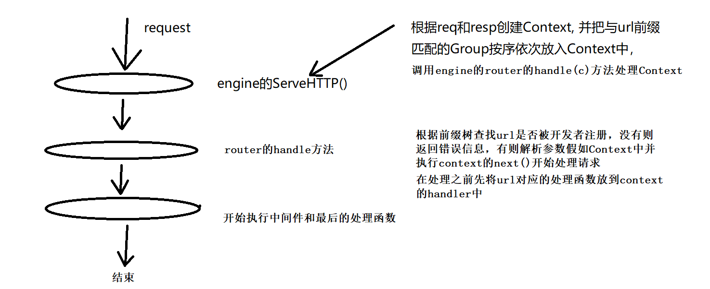
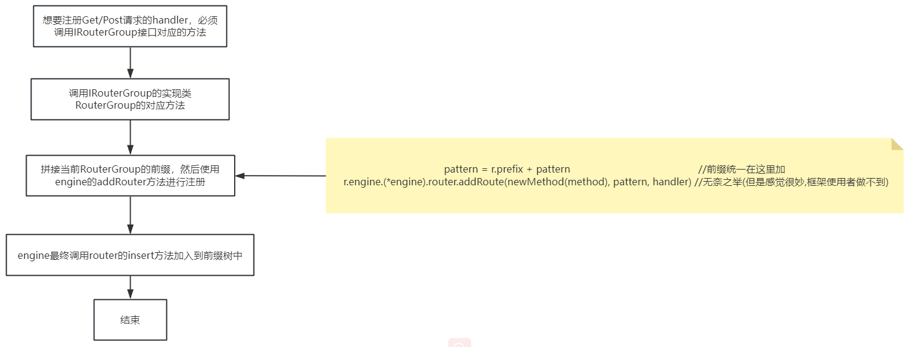

# Gee框架
## 参考的文档
- https://geektutu.com/post/gee.html
## 使用说明
- 在你的项目运行 `go get github.com/linyerun/Gee` 即可把这个框架引入到你的项目中。
```go
package main

import (
  "fmt"
  "github.com/linyerun/Gee/gee"
  "github.com/linyerun/Gee/iface"
  "html/template"
  "time"
)

func main() {
  e := gee.Default()

  // 普通路由方法的使用
  e.GET("/lin", func(c iface.IContext) {
    c.JSON(200, gee.H{"msg": "GET method,ok!", "code": 200})
  })
  e.POST("/ye", func(c iface.IContext) {
    c.JSON(200, gee.H{"msg": "POST method,ok!", "code": 200})
  })

  // 加载HTML文件的位置, 配合c.HTML使用
  e.SetFuncMap(template.FuncMap{"FormatAsDate": FormatAsDate}) //设置参数要在加载模板前进行
  e.LoadHTMLGlob("templates/*")
  e.GET("/html", func(c iface.IContext) {
    c.HTML(200, "format_as_date.html", gee.H{
      "title": "gee",
      "now":   time.Date(2023, 06, 22, 16, 20, 0, 0, time.UTC),
    })
  })

  // 加载静态文件
  e.Static("/assets", "./static")

  // 使用中间件
  e.Use(new(MyMiddleware))

  // 使用路由分组功能
  userGroup := e.Group("/user")
  {
    userGroup.GET("/lin", func(c iface.IContext) {
      c.JSON(200, gee.H{"msg": "GET method,ok!", "code": 200})
    })
    userGroup.POST("/ye", func(c iface.IContext) {
      c.JSON(200, gee.H{"msg": "POST method,ok!", "code": 200})
    })
    userGroup.Static("/assets", "./user_file")
    e.Use(new(MyMiddleware))
  }

  // 运行
  panic(e.Run(":8080"))
}

func FormatAsDate(t time.Time) string {
  year, month, day := t.Date()
  return fmt.Sprintf("%d-%02d-%02d", year, month, day)
}

type MyMiddleware struct {
}

func (m *MyMiddleware) PrevHandle(c iface.IContext) {
  fmt.Println(c.GetPath()+"执行前时间:", time.Now().Format("2006-01-02 15-04-05"))
}

func (m *MyMiddleware) LastHandle(c iface.IContext) {
  fmt.Println(c.GetPath()+"执行后时间:", time.Now().Format("2006-01-02 15-04-05"))
}
```


> 在项目的根目录下创建一个`static`文件夹，创建一个文件：`students.json`

```json
[
  {
    "name": "随风的叶子",
    "age": 22,
    "degree": "大三"
  },
  {
    "name": "随风",
    "age": 19,
    "degree": "大一"
  }
]
```


> 在项目的根目录下创建一个`templates`文件夹，文件夹下面创建一个文件`format_as_date.html`

```html
<html>
<body>
    <p>hello, {{.title}}</p>
    <p>Date: {{.now | FormatAsDate}}</p>
</body>
</html>
```


> 在项目的根目录下创建一个`user_file`文件夹，文件夹下面创建一个文件`user.json`

```json
{
  "name": "用户姓名",
  "birthday": "用户出生日期"
}
```
## 图解系统执行流程
### 请求处理过程

### handler注册过程
- Get/Post/Static

### 中间件注册过程

### 路由分组创建过程
## 实现简介

- engine：自身是一个路由分组，同时也是HTTP程序的入口，它管理了全局的路由分组(包括它自身)
- IRouterGroup：路由分组，我们可以使用`user方法`加入`中间件`，使用`GET`,`POST`,`Static`方法, 也是使用`Group方法`继续创建分组
- router：它整合了前缀树进来，用于管理我们的前缀路由和特定路由执行的方法。它被整合到engine中
- 大致的一个运行逻辑
  - engine实现了`ServeHTTP`，里面需要做三件事情
    1. 封装好`context`
    2. 将满足要求的middleware加入到c的handler中
    3. 交给handler处理
       1. 找到处理对应路径的`iface.HandlerFunc `
       2. 继续填充context信息
       3. 通过`realCtx.next()`，开始执行中间件和业务逻辑
## 功能简介

Gee框架是一个Web框架，用于帮助开发者更好的管理和处理前端发送过来的请求。使用该框架，开发者获取前端发送过来的请求数据、返回结果、管理请求路由，对路由进行分组、引入中间件对请求进行前置处理和后置处理、通过HTML模板解析和静态资源服务功能、请求过程中的错误捕获与恢复。
## 优势
1. 在Go提供的HTTP服务基础上进行封装，使得请求处理更加简单。
2. 路由管理使用了前缀树这个数据结果，优化了路由查询的性能。
3. 对请求处理过程中进行的错误，提升了用户的使用体验。
4. 分组控制，让同一组的路由可以配置同一个中间件进行前置、后置处理，减少了代码冗余。
## 包介绍
- iface: 这个包下都是接口，这些接口是提供给框架的使用者使用的
- utils: 工具包，目前提供了一个记录日志的工具
- gee  : 框架的核心实现代码
## 实现介绍
### 1. 上下文
- 接口：IContext，实现类：Context
- 开发者可以使用框架提供的IContext来处理客户端过来的请求
- 框架做的事情：
  - 客户端的请求过来之后，把 `req`, `resp`, `请求参数`, `请求路径`, `此请求涉及的中间件`全部封装到Context中
  - 首先在engine的ServeHTTP封装好涉及的中间件部分属性
  - 然后在router的handle封装好其他部分属性
  - 最后在router的handle执行开发者先前定义好的中间件和请求处理逻辑
### 2. 前缀树路由
- 实现的逻辑在 `gee/trie.go` 里面，每个trie的节点node有 `pattern` `part` `isWild` `children`,每个节点都有search和insert方法。
  - 缺点：唯一性得靠开发者注册得合理来保证，框架代码并不能保证insert进去的路径不会让客户端请求可以匹配到多个处理逻辑。
- trie.go被整合到router模块，router给每个请求方法都提供一个root的node节点
  - router的addRoute方法用到root的insert操作
  - router的handle方法使用到root的search操作
### 3. 分组控制
- 接口：IRouterGroup，实现类：routerGroup
- engine本身也是IRouterGroup，并且它管理了所有分组
- 每个分组可以使用 `GET`, `POST`, `USE`, `Static`等

### 4. 中间件
- 中间件本质上还是 `type HandlerFunc func(IContext)`，只不过用户注册中间件时需要实现`IHandler`接口，然后被我转成前面那个类型
  - 使用`newHandlerFunc`转即可
  - 在use那里转，即在routerGroup那里转
- 中间件在engine的ServeHTTP那里就会被按需封装到Context里面
- 然后在我们使用router的handle方法时，找到满足前缀的请求就会被执行。

### 5. 错误恢复
- 本质上就是在engine这个路由分组上加入一个middleware, 并让它作为首个被所有请求依赖的中间件。这样，所有出现的错误最后panic到它的next上，然后被它捕获。

### 6. 静态文件加载
- 在IRouterGroup接口上加入 `Static(relativePath, fileRoot string)` 方法，fileRoot表示所有静态文件在的文件夹
  - 假设 relativePath = /assets，路由分组的前缀为 /v1 , lin.css 在 fileRoot/lin/ye/run/lin.css 处，那么想要获取lin.css需要的请求方式为 `/v1/assets/lin/ye/run/lin.css`
- 实现
  - 使用 `http.StripPrefix` 这个函数来创建handler，然后使用闭包将这个handler封装成 `type HandlerFunc func(IContext)` 这个类型。
  - 最后将这个封装好的处理函数加入到前缀树中

### 7. HTML模板渲染
- HTML模板渲染相关的属性放在了 `global.go` 里面
  - `funcMap      template.FuncMap`：给用户提供了设置自定义渲染函数, 需要在将模板加入内存前进行设置
  - `htmlTemplate *template.Template`：给用户提供来将所有的模板加载进内存
- 最后它们在Context的HTML里面被使用